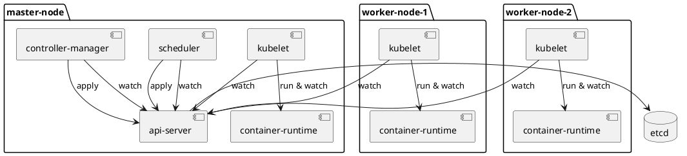

# Introduction

This repository is intended for demo-ing the manual install of kubernetes's components on both master and worker nodes.

It should be able to get you to a working single master (insecure) kubernetes setup on a set of VMs




# prerequisites
- vagrant
- the scp vagrant plugin : `vagrant plugin install vagrant-scp`
- [the GNU parallel CLI](https://www.gnu.org/software/parallel/)
- [jq](https://stedolan.github.io/jq/)

# setup
- run `vagrant up` to start the vms. This will create a master node and 2 worker nodes on your host's network

- run `./scripts/show_cluster_config | tee cluster.config`

- copy the cluster configuration to the nodes:
```sh
./scripts/copy_file_to_nodes cluster.config
```

- install the jq CLI on the nodes so they can read the config
```sh
./scripts/run_script_on_nodes install_jq_cli
```

- setup a container runtime
```sh
./scripts/run_script_on_nodes install_container_runtime
```

- download kubernetes
```sh
./scripts/download_kubernetes_binaries $(cat cluster.config | jq -r ".kubernetes_version") ./kubernetes
```
- download etcd
```sh
./scripts/download_etcd_binaries $(cat cluster.config | jq -r ".etcd3_version") ./etcd3
```

- copy kubelet & kube-proxy on the worker nodes
```sh
./scripts/copy_file_to_nodes ./kubernetes/workers worker
```

- copy kubelet, proxy, apiserver, scheduler and native controllers binaries to the master nodes
```sh
./scripts/copy_file_to_nodes ./etcd3 master
```