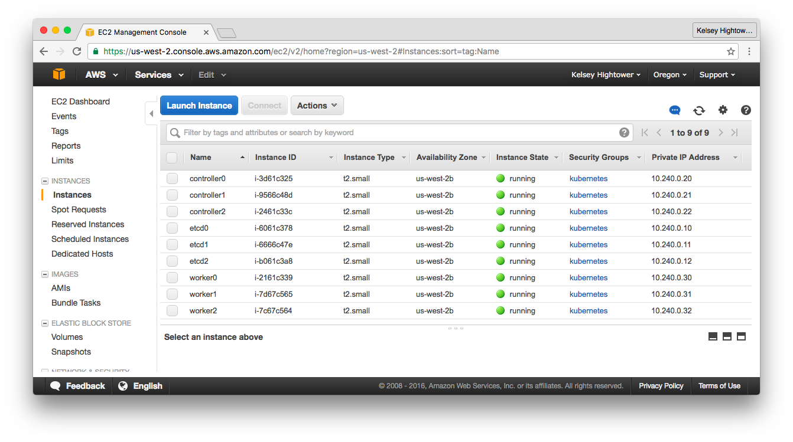

# Cloud Infrastructure Provisioning - Amazon Web Services

This lab will walk you through provisioning the compute instances required for running a H/A Kubernetes cluster. A total of 9 virtual machines will be created.

After completing this guide you should have the following compute instances:



> All machines will be provisioned with fixed private IP addresses to simplify the bootstrap process.

To make our Kubernetes control plane remotely accessible, a public IP address will be provisioned and assigned to a Load Balancer that will sit in front of the 3 Kubernetes controllers.

## Create a Custom Network

```
VPC_ID=$(aws ec2 create-vpc \
  --cidr-block 10.240.0.0/16 | \
  jq -r '.Vpc.VpcId')
```

```
aws ec2 modify-vpc-attribute \
  --vpc-id ${VPC_ID} \
  --enable-dns-support '{"Value": true}'
```

```
aws ec2 modify-vpc-attribute \
  --vpc-id ${VPC_ID} \
  --enable-dns-hostnames '{"Value": true}'
```

```
DHCP_OPTION_SET_ID=$(aws ec2 create-dhcp-options \
  --dhcp-configuration "Key=domain-name,Values=us-west-2.compute.internal" \
    "Key=domain-name-servers,Values=AmazonProvidedDNS" | \
  jq -r '.DhcpOptions.DhcpOptionsId')
```

```
aws ec2 associate-dhcp-options \
  --dhcp-options-id ${DHCP_OPTION_SET_ID} \
  --vpc-id ${VPC_ID}
```

Create a subnet for the Kubernetes cluster:

```
SUBNET_ID=$(aws ec2 create-subnet \
  --vpc-id ${VPC_ID} \
  --cidr-block 10.240.0.0/24 | \
  jq -r '.Subnet.SubnetId')
```

Create an internet gateway

```
INTERNET_GATEWAY_ID=$(aws ec2 create-internet-gateway | \
  jq -r '.InternetGateway.InternetGatewayId')
```

```
aws ec2 attach-internet-gateway \
  --internet-gateway-id ${INTERNET_GATEWAY_ID} \
  --vpc-id ${VPC_ID}
```

### Route Table

```
ROUTE_TABLE_ID=$(aws ec2 create-route-table \
  --vpc-id ${VPC_ID} | \
  jq -r '.RouteTable.RouteTableId')
```

```
aws ec2 associate-route-table \
  --route-table-id ${ROUTE_TABLE_ID} \
  --subnet-id ${SUBNET_ID}
```

```
aws ec2 create-route \
  --route-table-id ${ROUTE_TABLE_ID} \
  --destination-cidr-block 0.0.0.0/0 \
  --gateway-id ${INTERNET_GATEWAY_ID}
```

### Firewall Rules

```
SECURITY_GROUP_ID=$(aws ec2 create-security-group \
  --group-name kubernetes \
  --description "Kubernetes security group" \
  --vpc-id ${VPC_ID} | \
  jq -r '.GroupId')
```

```
aws ec2 authorize-security-group-ingress \
  --group-id ${SECURITY_GROUP_ID} \
  --protocol all
```

```
aws ec2 authorize-security-group-ingress \
  --group-id ${SECURITY_GROUP_ID} \
  --protocol all \
  --port 0-65535 \
  --cidr 10.240.0.0/16
```

```
aws ec2 authorize-security-group-ingress \
  --group-id ${SECURITY_GROUP_ID} \
  --protocol tcp \
  --port 22 \
  --cidr 0.0.0.0/0
```

```
aws ec2 authorize-security-group-ingress \
  --group-id ${SECURITY_GROUP_ID} \
  --protocol tcp \
  --port 443 \
  --cidr 0.0.0.0/0
```

## Create the Kubernetes Public IP Address

Create a public IP address that will be used by remote clients to connect to the Kubernetes control plane:

```
KUBERNETES_PUBLIC_IP=$(aws ec2 allocate-address \
  --domain vpc | \
  jq -r '.PublicIp') 
```

## Provision Virtual Machines

All the VMs in this lab will be provisioned using Ubuntu 16.04 mainly because it runs a newish Linux Kernel that has good support for Docker.

### Create Instance IAM Policies

```
cat > kubernetes-iam-role.json <<'EOF'
{
  "Version": "2012-10-17",
  "Statement": [
    {"Effect": "Allow", "Principal": { "Service": "ec2.amazonaws.com"}, "Action": "sts:AssumeRole"}
  ]
}
EOF
```

```
aws iam create-role \
  --role-name kubernetes \
  --assume-role-policy-document file://kubernetes-iam-role.json
```

```
cat > kubernetes-iam-policy.json <<'EOF'
{
  "Version": "2012-10-17",
  "Statement": [
    {"Effect": "Allow", "Action": ["ec2:*"], "Resource": ["*"]},
    {"Effect": "Allow", "Action": ["elasticloadbalancing:*"], "Resource": ["*"]},
    {"Effect": "Allow", "Action": ["route53:*"], "Resource": ["*"]},
    {"Effect": "Allow", "Action": ["ecr:*"], "Resource": "*"}
  ]
}
EOF
```

```
aws iam put-role-policy \
  --role-name kubernetes \
  --policy-name kubernetes \
  --policy-document file://kubernetes-iam-policy.json
```

```
aws iam create-instance-profile \
  --instance-profile-name kubernetes 
```

```
aws iam add-role-to-instance-profile \
  --instance-profile-name kubernetes \
  --role-name kubernetes
```

### Chosing an Image

Use the [Ubuntu Amazon EC2 AMI Locator](https://cloud-images.ubuntu.com/locator/ec2/) to find the right image-id for your zone. This guide assumes the `us-west-2` zone.

```
IMAGE_ID="ami-746aba14"
```

### Generate A SSH Key Pair

```
aws ec2 create-key-pair --key-name kubernetes | \
  jq -r '.KeyMaterial' > ~/.ssh/kubernetes_the_hard_way
```

```
chmod 600 ~/.ssh/kubernetes_the_hard_way
```

```
ssh-add ~/.ssh/kubernetes_the_hard_way 
```

### etcd

```
ETCD_0_INSTANCE_ID=$(aws ec2 run-instances \
  --associate-public-ip-address \
  --image-id ${IMAGE_ID} \
  --count 1 \
  --key-name kubernetes \
  --security-group-ids ${SECURITY_GROUP_ID} \
  --instance-type t2.small \
  --private-ip-address 10.240.0.10 \
  --subnet-id ${SUBNET_ID} | \
  jq -r '.Instances[].InstanceId')
```

```
aws ec2 create-tags \
  --resources ${ETCD_0_INSTANCE_ID} \
  --tags Key=Name,Value=etcd0
```

```
ETCD_1_INSTANCE_ID=$(aws ec2 run-instances \
  --associate-public-ip-address \
  --image-id ${IMAGE_ID} \
  --count 1 \
  --key-name kubernetes \
  --security-group-ids ${SECURITY_GROUP_ID} \
  --instance-type t2.small \
  --private-ip-address 10.240.0.11 \
  --subnet-id ${SUBNET_ID} | \
  jq -r '.Instances[].InstanceId')
```

```
aws ec2 create-tags \
  --resources ${ETCD_1_INSTANCE_ID} \
  --tags Key=Name,Value=etcd1
```

```
ETCD_2_INSTANCE_ID=$(aws ec2 run-instances \
  --associate-public-ip-address \
  --image-id ${IMAGE_ID} \
  --count 1 \
  --key-name kubernetes \
  --security-group-ids ${SECURITY_GROUP_ID} \
  --instance-type t2.small \
  --private-ip-address 10.240.0.12 \
  --subnet-id ${SUBNET_ID} | \
  jq -r '.Instances[].InstanceId')
```

```
aws ec2 create-tags \
  --resources ${ETCD_2_INSTANCE_ID} \
  --tags Key=Name,Value=etcd2
```

### Kubernetes Controllers

```
CONTROLLER_0_INSTANCE_ID=$(aws ec2 run-instances \
  --associate-public-ip-address \
  --iam-instance-profile 'Name=kubernetes' \
  --image-id ${IMAGE_ID} \
  --count 1 \
  --key-name kubernetes \
  --security-group-ids ${SECURITY_GROUP_ID} \
  --instance-type t2.small \
  --private-ip-address 10.240.0.20 \
  --subnet-id ${SUBNET_ID} | \
  jq -r '.Instances[].InstanceId')
```

```
aws ec2 create-tags \
  --resources ${CONTROLLER_0_INSTANCE_ID} \
  --tags Key=Name,Value=controller0
``` 

```
CONTROLLER_1_INSTANCE_ID=$(aws ec2 run-instances \
  --associate-public-ip-address \
  --iam-instance-profile 'Name=kubernetes' \
  --image-id ${IMAGE_ID} \
  --count 1 \
  --key-name kubernetes \
  --security-group-ids ${SECURITY_GROUP_ID} \
  --instance-type t2.small \
  --private-ip-address 10.240.0.21 \
  --subnet-id ${SUBNET_ID} | \
  jq -r '.Instances[].InstanceId')
```

```
aws ec2 create-tags \
  --resources ${CONTROLLER_1_INSTANCE_ID} \
  --tags Key=Name,Value=controller1
``` 

```
CONTROLLER_2_INSTANCE_ID=$(aws ec2 run-instances \
  --associate-public-ip-address \
  --iam-instance-profile 'Name=kubernetes' \
  --image-id ${IMAGE_ID} \
  --count 1 \
  --key-name kubernetes \
  --security-group-ids ${SECURITY_GROUP_ID} \
  --instance-type t2.small \
  --private-ip-address 10.240.0.22 \
  --subnet-id ${SUBNET_ID} | \
  jq -r '.Instances[].InstanceId')
```

```
aws ec2 create-tags \
  --resources ${CONTROLLER_2_INSTANCE_ID} \
  --tags Key=Name,Value=controller2
``` 

### Kubernetes Workers

```
WORKER_0_INSTANCE_ID=$(aws ec2 run-instances \
  --associate-public-ip-address \
  --iam-instance-profile 'Name=kubernetes' \
  --image-id ${IMAGE_ID} \
  --count 1 \
  --key-name kubernetes \
  --security-group-ids ${SECURITY_GROUP_ID} \
  --instance-type t2.small \
  --private-ip-address 10.240.0.30 \
  --subnet-id ${SUBNET_ID} | \
  jq -r '.Instances[].InstanceId')
```

```
aws ec2 create-tags \
  --resources ${WORKER_0_INSTANCE_ID} \
  --tags Key=Name,Value=worker0
```

```
WORKER_1_INSTANCE_ID=$(aws ec2 run-instances \
  --associate-public-ip-address \
  --iam-instance-profile 'Name=kubernetes' \
  --image-id ${IMAGE_ID} \
  --count 1 \
  --key-name kubernetes \
  --security-group-ids ${SECURITY_GROUP_ID} \
  --instance-type t2.small \
  --private-ip-address 10.240.0.31 \
  --subnet-id ${SUBNET_ID} | \
  jq -r '.Instances[].InstanceId')
```

```
aws ec2 create-tags \
  --resources ${WORKER_1_INSTANCE_ID} \
  --tags Key=Name,Value=worker1
```

```
WORKER_2_INSTANCE_ID=$(aws ec2 run-instances \
  --associate-public-ip-address \
  --iam-instance-profile 'Name=kubernetes' \
  --image-id ${IMAGE_ID} \
  --count 1 \
  --key-name kubernetes \
  --security-group-ids ${SECURITY_GROUP_ID} \
  --instance-type t2.small \
  --private-ip-address 10.240.0.32 \
  --subnet-id ${SUBNET_ID} | \
  jq -r '.Instances[].InstanceId')
```

```
aws ec2 create-tags \
  --resources ${WORKER_2_INSTANCE_ID} \
  --tags Key=Name,Value=worker2
```


## Verify

```
aws ec2 describe-instances \
  --filters "Name=instance-state-name,Values=running" | \
  jq -j '.Reservations[].Instances[] | .InstanceId, "  ", .Placement.AvailabilityZone, "  ", .PrivateIpAddress, "  ", .PublicIpAddress, "\n"'
```
```
i-f3714f2e  us-west-2c  10.240.0.22  XX.XXX.XX.XX
i-ae714f73  us-west-2c  10.240.0.11  XX.XX.XX.XXX
i-f4714f29  us-west-2c  10.240.0.21  XX.XX.XXX.XXX
i-f6714f2b  us-west-2c  10.240.0.12  XX.XX.XX.XX
i-e26e503f  us-west-2c  10.240.0.30  XX.XX.XXX.XXX
i-e36e503e  us-west-2c  10.240.0.31  XX.XX.XX.XX
i-e8714f35  us-west-2c  10.240.0.10  XX.XX.XXX.XXX
i-78704ea5  us-west-2c  10.240.0.20  XX.XX.XXX.XXX
i-4a6e5097  us-west-2c  10.240.0.32  XX.XX.XX.XX
```
