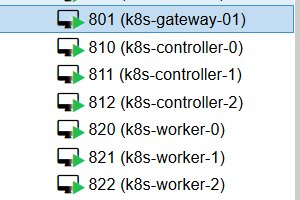
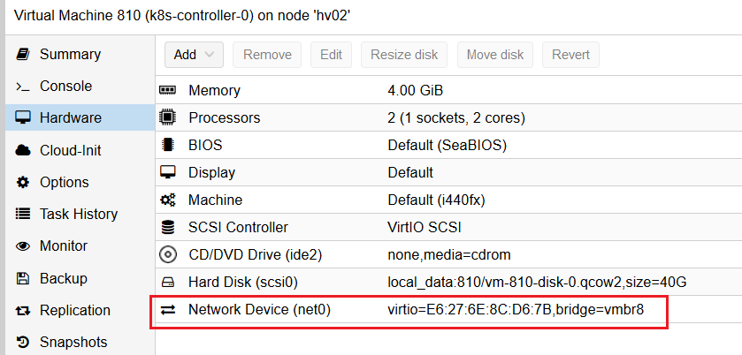
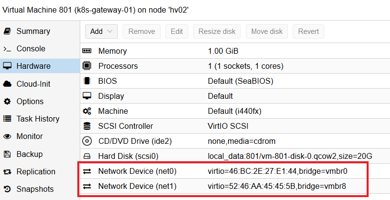

# Prerequisites

## Proxmox Hypervisor

This tutorial is intended to be performed with a [Proxmox](https://proxmox.com/en/) hypervisor, but you can also use it with ESXi, KVM, Virtualbox or other hypervisor.

> The compute resources required for this tutorial is 26GB of RAM and 100GB HDD (or SSD).

List of the VM used in this tutorial :

|Name|Role|vCPU|RAM|Storage (thin)|IP|OS|
|--|--|--|--|--|--|--|
|controller-0|controller|2|4GB|40GB|192.168.8.10/24|Ubuntu|
|controller-1|controller|2|4GB|40GB|192.168.8.11/24|Ubuntu|
|controller-2|controller|2|4GB|40GB|192.168.8.12/24|Ubuntu|
|worker-0|worker|2|4GB|40GB|192.168.8.20/24|Ubuntu|
|worker-1|worker|2|4GB|40GB|192.168.8.21/24|Ubuntu|
|worker-2|worker|2|4GB|40GB|192.168.8.22/24|Ubuntu|
|gateway-01|Reverse Proxy, client tools, gateway|2|4GB|40GB|192.168.8.22/24|Debian|

On the Proxmox hypervisor, I just added the `k8s-` prefix in the VM names.



## Prepare the environment

### Hypervisor network

For this tutorial, you need 2 networks on your Proxmox hypervisor :

* a public network bridge (`vmbr0` in the following screenshot).
* a private Kubernetes network bridge (`vmbr8` in the following screenshot).


All the Kubernetes nodes (workers and controllers) only need one network interface linked to the private Kubernetes network (`vmbr8`).



The reverse proxy / client tools / gateway VM need to have 2 network interfaces, one linked to the private Kubernetes network (`vmbr8`) and the other linked to the public network (`vmbr0`).



### Network architecture

This diagram represents the network design:


> If you want, you can define the configuration for the IPv6 stack.

### Gateway VM installation

> The basic VM installation process is not the purpose of this tutorial.
> Because it's just a tutorial, the IPv6 stack is not configured, but you can configure it if you want.

This VM is used as a NAT gateway for the private Kubernetes network, as a reverse proxy and as a client tools.

This means all the client steps like certificates generation will be done on this VM (in the next part of this tutorial).

You have to:

* Install the latest [amd64 Debian netinst image](https://www.debian.org/CD/netinst/) on this VM.

* Configure the network interfaces (see the network architecture). Example of `/etc/network/interfaces` file if ens18 is your public interface and ens19 is your private interface (you need to replace `PUBLIC_IP_ADDRESS`, `MASK` and `PUBLIC_IP_GATEWAY` with you values):

```bash
source /etc/network/interfaces.d/*

# The loopback network interface
auto lo
iface lo inet loopback

# The public network interface
auto ens18
allow-hotplug ens18
iface ens18 inet static
        address PUBLIC_IP_ADDRESS/MASK
        gateway PUBLIC_IP_GATEWAY
        dns-nameservers 9.9.9.9

# The private network interface
auto ens19
allow-hotplug ens19
iface ens19 inet static
        address 192.168.8.1/24
        dns-nameservers 9.9.9.9
```

> If you want, you can define the configuration for the IPv6 stack.

* Define the VM hostname:

```bash
hostnamectl set-hostname gateway-01
```

* Update the packages list and update the system:

```bash
sudo apt-get update && sudo apt-get upgrade -y
```

* Install SSH, vim, tmux, NTP and iptables-persistent:

```bash
sudo apt-get install ssh vim tmux ntp iptables-persistent -y
```

* Enable and start the SSH and NTP services:

```bash
sudo systemctl enable ntp
sudo systemctl start ntp
sudo systemctl enable ssh
sudo systemctl start ssh
```

* Enable IP routing:

```bash
echo 'net.ipv4.ip_forward=1' >> /etc/sysctl.conf
echo '1' > /proc/sys/net/ipv4/ip_forward
```

> If you want, you can define the configuration for the IPv6 stack.

* Configure the iptables firewall (allow some ports and configure NAT). Example of `/etc/iptables/rules.v4` file if ens18 is your public interface and ens19 is your private interface:

```bash
# Generated by xtables-save v1.8.2 on Fri Jun  5 16:45:02 2020
*nat
-A POSTROUTING -o ens18 -j MASQUERADE
COMMIT

*filter
-A INPUT -i lo -j ACCEPT
# allow ssh, so that we do not lock ourselves
-A INPUT -i ens18 -p tcp -m tcp --dport 22 -j ACCEPT
-A INPUT -i ens18 -p tcp -m tcp --dport 80 -j ACCEPT
-A INPUT -i ens18 -p tcp -m tcp --dport 443 -j ACCEPT
-A INPUT -i ens18 -p icmp -j ACCEPT
# allow incoming traffic to the outgoing connections,
# et al for clients from the private network
-A INPUT -m state --state RELATED,ESTABLISHED -j ACCEPT
# prohibit everything else incoming
-A INPUT -i ens18 -j DROP
COMMIT
# Completed on Fri Jun  5 16:45:02 2020
```

> If you want, you can define the configuration for the IPv6 stack.

* If you want to restore iptables rules:

```bash
iptables-restore < /etc/iptables/rules.v4
```

* Configure /etc/hosts file. Example for controller-0 (need to replace `PUBLIC_GW_IP`):

```bash
127.0.0.1       localhost
PUBLIC_GW_IP    gateway-01.external gateway-01

# The following lines are desirable for IPv6 capable hosts
::1     localhost ip6-localhost ip6-loopback
ff02::1 ip6-allnodes
ff02::2 ip6-allrouters

192.168.8.10    controller-0
192.168.8.11    controller-1
192.168.8.12    controller-2

192.168.8.20    worker-0
192.168.8.21    worker-1
192.168.8.22    worker-2
```

* To confirm the network configuration, reboot the VM and check the active IP addresses:

```bash
sudo reboot
```

### Kubernetes nodes VM installation

> The basic VM installation process is not the purpose of this tutorial.
> Because it's just a tutorial, the IPv6 stack is not configured, but you can configure it if you want.

These VM are used as Kubernetes node (controllers or workers).

The basic VM configuration process is the same of the 6 VM (you can also configure one, clone it and change IP address and hostname for each clone).

You have to:

* Install the [Ubuntu 18.04.4 LTS (Bionic Beaver) Server install image](https://releases.ubuntu.com/18.04/) on this VM.

* Configure the network interface (see the network architecture). Example of `/etc/netplan/00-installer-config.yaml` file if ens18 is the name of your private network interface (you need to change the IP address depending on the installed server):

```bash
# This is the network config written by 'subiquity'
network:
  ethernets:
    ens18:
      addresses:
      - 192.168.8.10/24
      gateway4: 192.168.8.1
      nameservers:
        addresses:
        - 9.9.9.9
  version: 2
```

> If you want, you can define the configuration for the IPv6 stack.

* Define the VM hostname (example for controller-0):

```bash
hostnamectl set-hostname controller-0
```

* Update the packages list and update the system:

```bash
sudo apt-get update && sudo apt-get upgrade -y
```

* Install SSH and NTP:

```bash
sudo apt-get install ssh ntp -y
```

* Enable and start the SSH and NTP services:

```bash
sudo systemctl enable ntp
sudo systemctl start ntp
sudo systemctl enable ssh
sudo systemctl start ssh
```

* Configure /etc/hosts file. Example for controller-0 (need to replace `PUBLIC_GW_IP` and adapt this sample config on each VM):

```bash
127.0.0.1 localhost
127.0.1.1 controller-0

# The following lines are desirable for IPv6 capable hosts
::1     ip6-localhost ip6-loopback
fe00::0 ip6-localnet
ff00::0 ip6-mcastprefix
ff02::1 ip6-allnodes
ff02::2 ip6-allrouters

PUBLIC_GW_IP    gateway-01.external
192.168.8.1     gateway-01

192.168.8.11    controller-1
192.168.8.12    controller-2

192.168.8.20    worker-0
192.168.8.21    worker-1
192.168.8.22    worker-2
```

* To confirm the network configuration, reboot the VM and check the active IP addresses:

```bash
sudo reboot
```

## Running Commands in Parallel with tmux

[tmux](https://github.com/tmux/tmux/wiki) can be used to run commands on multiple compute instances at the same time. Labs in this tutorial may require running the same commands across multiple compute instances, in those cases consider using tmux and splitting a window into multiple panes with synchronize-panes enabled to speed up the provisioning process.

> The use of tmux is optional and not required to complete this tutorial.


> Enable synchronize-panes by pressing `ctrl+b` followed by `shift+:`. Next type `set synchronize-panes on` at the prompt. To disable synchronization: `set synchronize-panes off`.

Next: [Installing the Client Tools](02-client-tools.md)
