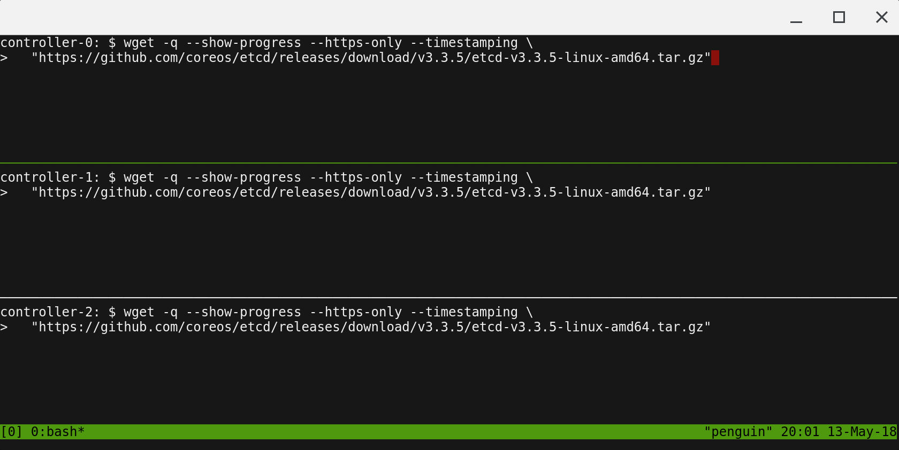

# Prerequisites

## KVM

This tutorial leverages KVM. So you need to have a linux machine on which KVM is installed and running.

The following KVM-related tools will be used frequently:

* [Virtual Machine Manager](https://virt-manager.org/): used to create VMs and Networks.
* [qemu-img](https://qemu.weilnetz.de/doc/qemu-doc.html#disk_005fimages): used to create [image files](https://people.gnome.org/~markmc/qcow-image-format-version-1.html).

In this tutorial, [openSUSE Tumbleweed](https://en.opensuse.org/Portal:Tumbleweed) will be used as host PC, but in most cases there should be no problem caused by specific distributions or libvirt versions.

Currently, I use the following packages:

```
# cat /etc/os-release
NAME="openSUSE Tumbleweed"
# VERSION="20190201"
ID="opensuse-tumbleweed"
ID_LIKE="opensuse suse"
VERSION_ID="20190201"
PRETTY_NAME="openSUSE Tumbleweed"
ANSI_COLOR="0;32"
CPE_NAME="cpe:/o:opensuse:tumbleweed:20190201"
BUG_REPORT_URL="https://bugs.opensuse.org"
HOME_URL="https://www.opensuse.org/"
# rpm -qa | grep qemu
qemu-ui-sdl-3.1.0-2.4.x86_64
qemu-ovmf-x86_64-2018+git1542164568.85588389222a-3.2.noarch
qemu-sgabios-8-2.4.noarch
qemu-vgabios-1.12.0-2.4.noarch
qemu-ui-curses-3.1.0-2.4.x86_64
qemu-block-rbd-3.1.0-2.4.x86_64
qemu-x86-3.1.0-2.4.x86_64
qemu-ipxe-1.0.0+-2.4.noarch
qemu-seabios-1.12.0-2.4.noarch
qemu-block-curl-3.1.0-2.4.x86_64
libvirt-daemon-qemu-4.10.0-2.2.x86_64
qemu-ui-gtk-3.1.0-2.4.x86_64
libvirt-daemon-driver-qemu-4.10.0-2.2.x86_64
qemu-tools-3.1.0-2.4.x86_64
qemu-ksm-3.1.0-2.4.x86_64
qemu-block-ssh-3.1.0-2.4.x86_64
qemu-3.1.0-2.4.x86_64
#
#
# rpm -qa | grep libvirt
libvirt-daemon-driver-nodedev-4.10.0-2.2.x86_64
libvirt-daemon-driver-storage-4.10.0-2.2.x86_64
libvirt-libs-4.10.0-2.2.x86_64
libvirt-daemon-driver-storage-core-4.10.0-2.2.x86_64
libvirt-daemon-driver-storage-disk-4.10.0-2.2.x86_64
libvirt-daemon-driver-storage-iscsi-direct-4.10.0-2.2.x86_64
libvirt-daemon-driver-nwfilter-4.10.0-2.2.x86_64
libvirt-daemon-4.10.0-2.2.x86_64
libvirt-glib-1_0-0-2.0.0-1.1.x86_64
libvirt-daemon-driver-storage-gluster-4.10.0-2.2.x86_64
libvirt-daemon-config-network-4.10.0-2.2.x86_64
libvirt-daemon-driver-interface-4.10.0-2.2.x86_64
libvirt-daemon-driver-storage-logical-4.10.0-2.2.x86_64
libvirt-daemon-qemu-4.10.0-2.2.x86_64
libvirt-daemon-driver-network-4.10.0-2.2.x86_64
libvirt-daemon-driver-secret-4.10.0-2.2.x86_64
libvirt-daemon-driver-storage-scsi-4.10.0-2.2.x86_64
libvirt-daemon-driver-qemu-4.10.0-2.2.x86_64
python3-libvirt-python-4.10.0-1.2.x86_64
libvirt-daemon-driver-storage-iscsi-4.10.0-2.2.x86_64
libvirt-daemon-driver-storage-mpath-4.10.0-2.2.x86_64
libvirt-client-4.10.0-2.2.x86_64
libvirt-daemon-driver-storage-rbd-4.10.0-2.2.x86_64
#
```

## Running Commands in Parallel with tmux

[tmux](https://github.com/tmux/tmux/wiki) can be used to run commands on multiple compute instances at the same time. Labs in this tutorial may require running the same commands across multiple compute instances, in those cases consider using tmux and splitting a window into multiple panes with `synchronize-panes` enabled to speed up the provisioning process.

> The use of tmux is optional and not required to complete this tutorial.



If you want to setup tmux like above, `ctrl+b` -> `"` twice, then `ctrl+b` -> `alt+2`.

You can move to another window by `ctrl+b`, then an arrow key where you want to move.

> Enable `synchronize-panes`: `ctrl+b` then `shift :`. Then type `set synchronize-panes on` at the prompt. To disable synchronization: `set synchronize-panes off`.
>

Next: [Provisioning Compute Resources](02-compute-resources.md)
